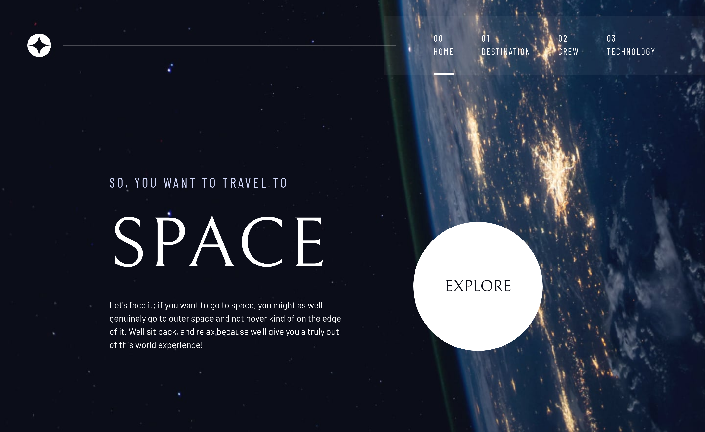

# Frontend Mentor - Space tourism website solution

This is a solution to the [Space tourism website challenge on Frontend Mentor](https://www.frontendmentor.io/challenges/space-tourism-multipage-website-gRWj1URZ3). Frontend Mentor challenges help you improve your coding skills by building realistic projects.

## Table of contents

- [Overview](#overview)
    - [The challenge](#the-challenge)
    - [Screenshot](#screenshot)
    - [Links](#links)
- [My process](#my-process)
    - [Built with](#built-with)
    - [What I learned](#what-i-learned)
    - [Continued development](#continued-development)
    - [Useful resources](#useful-resources)

## Overview

### The challenge

Users should be able to:

- View the optimal layout for each of the website's pages depending on their device's screen size
- See hover states for all interactive elements on the page
- View each page and be able to toggle between the tabs to see new information

### Screenshot

### Links

- Solution URL: [Space Tourism Website](https://www.frontendmentor.io/solutions/responsive-space-tourism-website-using-htmlcss-tailwind-and-js-JRP4vck_Sz)
- Live Site URL: [Space Tourism Website](https://fem-space-tourism-website-pi.vercel.app/)

## My process

### Built with

- Semantic HTML5 markup
- CSS custom properties
- Flexbox
- CSS Grid
- Mobile-first workflow
- [Tailwind](https://tailwindcss.com/) - For styles
- [Vite](https://vite.dev/) - Build tool

### What I learned

- Learned about how to structure content and use different assets according to the screen size.

### Continued development

- Building the project with a javascript framework.

### Useful resources

- [tailwind docs](https://tailwindcss.com/docs) - This helped me put styles.
- [Kevin Powell](https://scrimba.com/build-a-space-travel-website-c014) - The course provided for the project to follow along.
